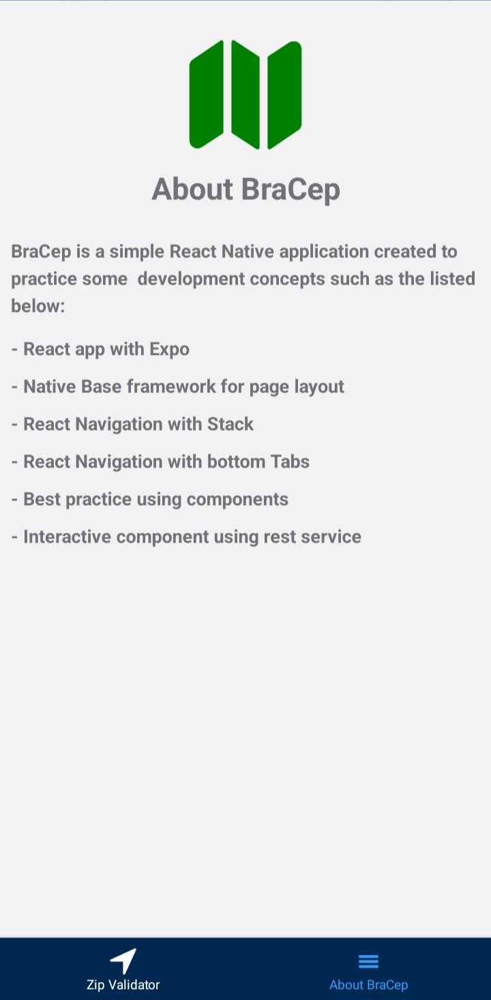
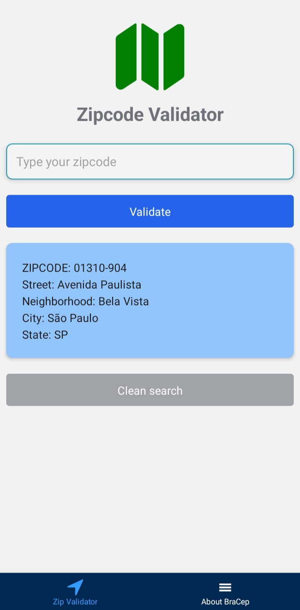
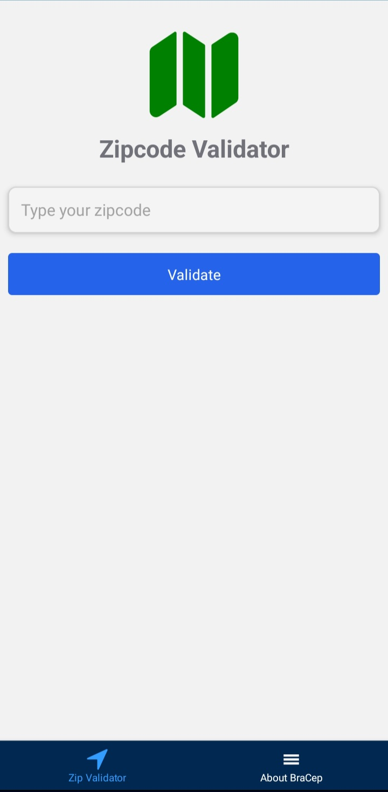
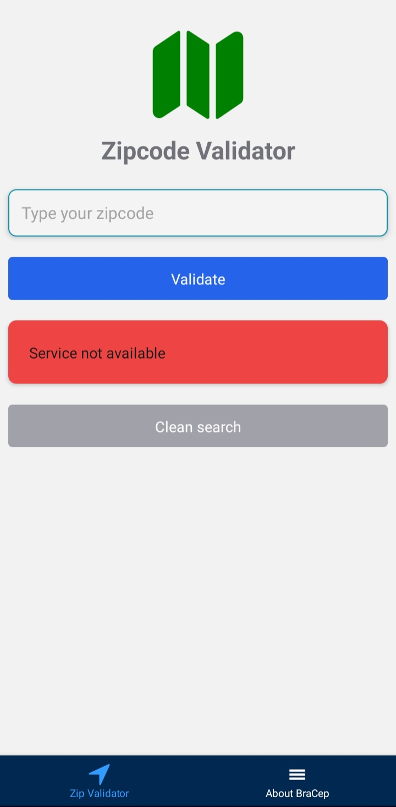
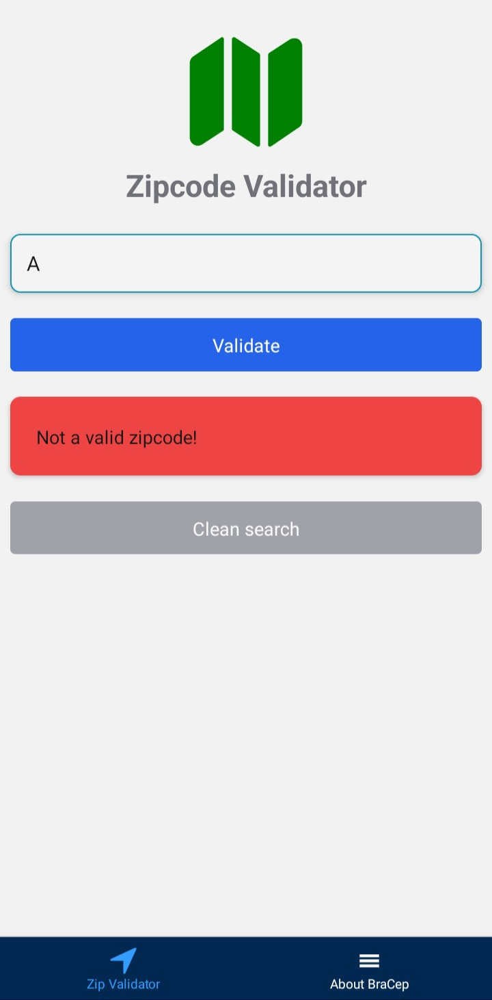

# Bracep
BraCep is a simple React Native application created to practice some development concepts such as the listed below:

- React app with Expo
- Native Base framework for page layout
- React Navigation with Stack
- React Navigation with bottom Tabs
- Best practice using components
- Interactive component using rest service

<h1 align="center">
    
    
    
    
    
    
</h1>


### Run instruction

```bash
# Clone this repository
$ git clone https://github.com/nilsonbarcelos/bracep.git

# Go to repository
$ cd Bracep

# Install the dependencies
$ npm install
```

### Run the project

```bash
$ expo start
```
